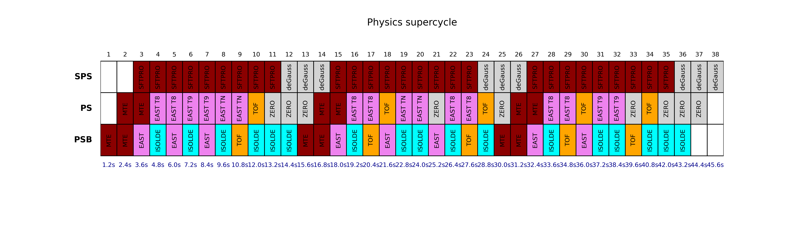

# Supercycles modelling for PSB-PS-SPS
A set of python functions for modelling the present and future supercycle composition and expected time sharing for the different facilities in the PSB, PS and SPS. 

 

For corrections & suggestions contact: [tirsi.prebibaj@cern.ch](mailto:tirsi.prebibaj@cern.ch)

Relevant presentations and notes:

- **SPS Operation and Future Proton Sharing Scenarios for the ECN3 facility** ([CERN-PBC-NOTE 2023001](https://cds.cern.ch/record/2848908/files/CERN-PBC-Notes-2023-001.pdf)).
- **Proton sharing in the injector complex post LS3**, Chamonix Workshop 2025 ([online](https://indi.to/RT4HJ) - restricted access).
